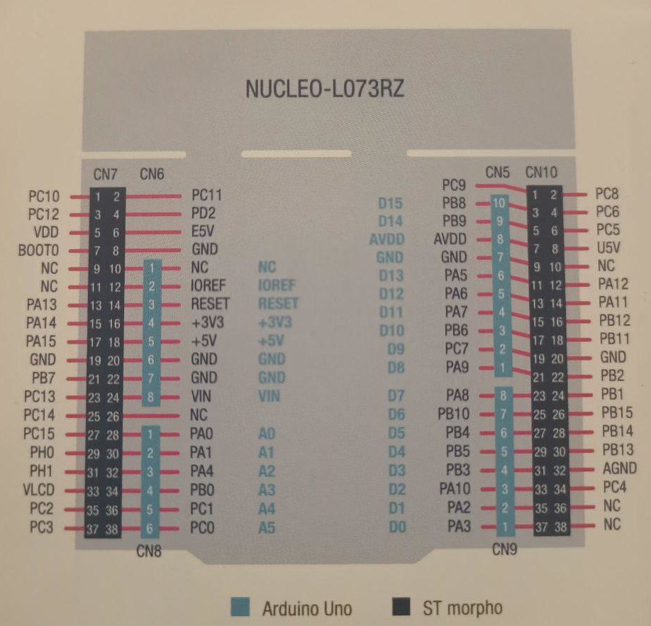

> [Home](../README.md) > [Documentation](./README.md)

# Le matériel

Pour la base du projet nous avons besoin d'une carte supportant le protocole LoRaWAN : **STMicroelectronics P-NUCLEO-LRWAN2** modèle L073RZ

Pour le preuve de concept nous allons utiliser des capteurs de gaz : **MQ2** et **MQ5**.

# Mise en place

## Capteur MQ-5

|Broche capteur|PIN STM32|
|---|---|
|VCC (Volt Courant Continue) - alimentation|CN7 18|
|GND (GrouND) - masse|CN7 20-22|
|AOUT (Analogue OUT) - sortie analogique|CN7 28 (A0)|
|DOUT (Digitel OUT) - sortie digital|-|